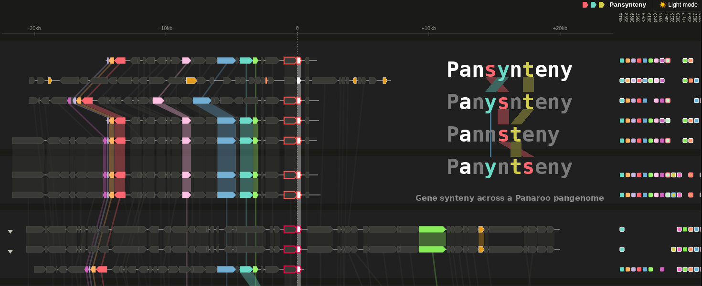

<p align="center">
  
</p>

A local, interactive gene-order viewer for a Panaroo pangenome. Search any
gene cluster by name or annotation, then build a gene synteny
chart on demand around this anchor gene, +/- a flanking window, sampled across carrier
genomes. For annotation, the script accepts a list of genes to highlight, plus a metadata file. 
A quick comparison bar shows whether each highlighted gene is visible in the window / present
on another contig or is truly absent in the strain.

Dataset-agnostic: a genome is viewable if it has a column in Panaroo's
`gene_presence_absence.csv` and a matching Prokka GFF -- nothing else is
required. Metadata is optional. 

## Requirements

Python 3, standard library only. No pip installs, no database, no build step.

## Quick setup

```
python3 pangenome_viewer.py --setup     # answer the prompts, writes the config
python3 pangenome_viewer.py             # start the server
```
Then open <http://localhost:8765/>. On a machine with no GUI, tunnel in
from your laptop first:
```
ssh -L 8765:localhost:8765 <this-host>
```

`--setup` tab-completes paths, lets you pick metadata columns off the
file's real header instead of typing them, and checks every join before it
writes anything. Running `pangenome_viewer.py` with no config at all
offers the same walkthrough, as long as you are at an interactive
terminal; under `nohup`/systemd it reports the missing settings and exits.

### What you'll need

Only the first two are required. Every other input is optional, and the
feature that uses it simply turns itself off when it's blank.

| Input | Config key | What it is |
|---|---|---|
| **Panaroo output** | `panaroo_csv` | `gene_presence_absence.csv` from a Panaroo run. Give `--setup` either this file or the directory holding it. |
| **Prokka output** | `prokka_dir` | One subdirectory per genome, each containing `<stem>.gff`. Every gene name and annotation shown in the viewer is read from these GFFs. Layout below. |
| Metadata table | `metadata_tsv` | Any per-genome table (Enterobase export, your own spreadsheet) with one column of genome IDs. Drives row labels, colouring, filtering and sort order. Tab- or comma-delimited. |
| RFE / gene list | `rfe_features_txt` | A list of genes to highlight, one per row, in a `feature` column. An optional `Annotation` column supplies your own name for a gene, used in place of Prokka's; an optional `importance` column is shown alongside it. Despite the name, nothing about it is machine-learning specific. |
| MGE table | `mge_genes_tsv` | Per-genome mobile-element calls (e.g. geNomad), used to mark genes carried on plasmids or prophage. |

A genome is viewable only if its stem is **both** a genome-column header
in `panaroo_csv` **and** has a matching `<stem>.gff` under `prokka_dir`.
Neither is inferred from the other. Every path is absolute — nothing is
inferred from where you put this folder.

## If you don't have Prokka and Panaroo output yet

Pansynteny reads the *output* of Prokka + Panaroo — it doesn't run either
itself.

1. **Annotate every assembly with Prokka**, one genome per output
   directory, each named after that genome (this is what becomes the
   `genome_id`):
   ```
   for fasta in /path/to/assemblies/*.fasta; do
     stem=$(basename "$fasta" .fasta)
     prokka --compliant --outdir prokka_out/"$stem" --prefix "$stem" "$fasta"
   done
   ```
   `--compliant` (Genbank/ENA/DDBJ compliance mode) matters here: without it
   Prokka annotates contigs down to 1bp, so drop it and you'll get extra
   tiny contigs a `--compliant` run wouldn't have annotated at all.
2. **Run Panaroo across every genome's Prokka GFF** to build the
   pangenome:
   ```
   panaroo --input prokka_out/*/*.gff -o panaroo_out --remove-invalid-genes --merge_paralogs --clean-mode moderate
   ```
   This produces `panaroo_out/gene_presence_absence.csv`, which is what
   `panaroo_csv` points to.

## Setup in detail

### The layout `prokka_dir` must have

What Prokka's own `--outdir`/`--prefix` produces: one subdirectory per
genome, named after that genome's stem, containing at minimum `<stem>.gff`
(required — a genome without one isn't viewable at all) and, optionally,
`<stem>.faa`/`<stem>.ffn` (used for the per-strain protein/nucleotide
sequence panel; the tool works without them, that panel just has nothing
to show).

**All gene annotations come from these GFFs.** Every product description
on a gene arrow, in a tooltip, in the legend and in search results is
Prokka's own call — Pansynteny adds no annotation of its own. The one way
to change what is displayed is the `Annotation` column described below.
```
prokka_dir/
  GENOME_A/
    GENOME_A.gff
    GENOME_A.faa
    GENOME_A.ffn
    ... (Prokka's other output files, unused)
  GENOME_B/
    GENOME_B.gff
    ...
```

### What `--setup` checks

- **Panaroo** — give it either the output directory or
  `gene_presence_absence.csv` itself; reports how many genome columns
  it found.
- **Prokka** — reports how many of those genome columns have a
  matching `<stem>/<stem>.gff`, and if the answer is "almost none",
  prints example stems from both sides so you can see the naming
  mismatch.
- **Stem suffixes** — detects assembler suffixes on the genome stems
  (`.result`, `.scaffold`, `.result.fasta`, ...) and offers to strip
  them. A cohort assembled by more than one route carries a *mix* of
  these, which is handled; the stripped ID is what the metadata join
  matches on, so this matters beyond cosmetics.
- **Metadata** — scores *every* column against your genome IDs and
  proposes the one that actually joins best, which you confirm or
  override. A column that exists but joins to nothing is otherwise
  invisible until every row shows up as `Unknown`. If nothing joins at
  all, it prints genome IDs next to the closest column's values, since
  the usual cause is the suffix question above rather than the file.
  Recognised Enterobase antigen/source columns are offered by name.
- **RFE features** — requires a `feature` column (a missing one is a hard
  error, not a warning), reports whether `importance` and `Annotation`
  are present, and counts how many features resolve to a real Panaroo
  cluster. This file and the metadata table may be tab- or
  comma-delimited; the delimiter is detected from the header rather than
  assumed from the extension.

  **If an `Annotation` column is present it takes precedence over the
  Prokka annotation** for the genes it names — useful when Prokka has
  called something `hypothetical protein` and you know it as `nleC`. It
  replaces Prokka's text as the legend label; in tooltips and search
  results it is shown on the title line with Prokka's own annotation still
  beneath it, so nothing is hidden. Genes absent from the file, or rows
  with the column blank, keep Prokka's annotation throughout.
- **MGE table** — checks all four required columns exist.

### Editing the config afterwards

`pangenome_viewer.config` is gitignored, since it's deployment-specific.

Re-running `--setup` on an existing config offers each current value as
the default, so changing one setting is a walk through pressing Enter;
type `none` at an optional path to clear it. Settings the walkthrough
doesn't ask about (the test-score table) are preserved as-is.

The generated file keeps all the explanatory comments from
`pangenome_viewer.config.example`, so hand-editing it afterwards is
fine — as is skipping `--setup` entirely and copying the example across
to fill in by hand. For exactly what each setting does, see those
comments and the docstring at the top of `pangenome_viewer.py`.

### CLI flags and ports

Any config value can be overridden, or the config file skipped
altogether, with the matching flag:
```
python3 pangenome_viewer.py --panaroo-csv /abs/path.csv --prokka-dir /abs/dir
```
The server listens on port 8765 by default; `--port` changes it, e.g.
`--port 9000` (adjust both `8765`s in the SSH tunnel to match).

## Design notes

`dev/BUILD_NOTES_pangenome_viewer.md` has the fuller history of this tool's
design decisions (gutter markers, the genome-count toggle, the metadata
filter boxes, the refound-placeholder handling, etc.) from when it lived
inside the larger analysis project this was extracted from.

`dev/` holds tooling used while working on Pansynteny, not needed to run
it: `dev/pgv_lookup.py` answers "does genome X really carry cluster Y?"
straight from the Panaroo CSV via a byte-offset index, for checking a
claim by hand without starting the server. It shares the config file and
CLI flags, so it always looks at the same data.
